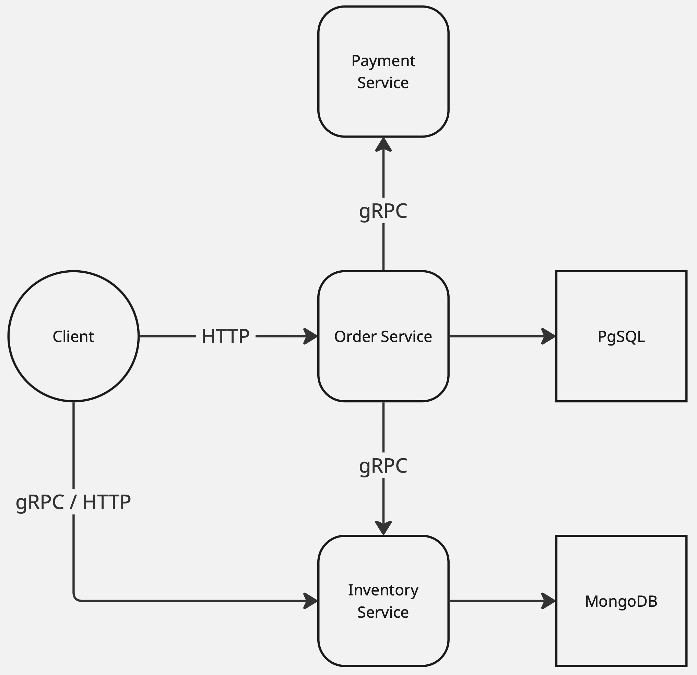

# Микро маркетплейс

Микросервисная архитектура маркетплейса, включающая сервисы заказов, склада и платежей.

---

## Архитектура сервисов

### Order-Service (HTTP + OpenAPI)

Сервис управления заказами.

| Характеристика  | Значение    |
|-----------------|-------------|
| Язык            | Go          |
| Протокол        | HTTP/REST   |
| Фреймворк       | Chi         |
| Архитектура     | Слоистая    |
| Codegen         | OpenAPI     |
| База данных     | PostgreSQL  |
| Миграции        | goose       |
| Контейнеризация | Docker      |

**Функции:**
- создание, оплата, отмена заказа
- хранение информации о товаре
- вызов **Inventory-Service** (предоставление информации о товаре)
- вызов **Payment-Service** (оплата / отмена заказа)

---

### Inventory-Service (gRPC)

Сервис управления товарами.

| Характеристика  | Значение       |
|-----------------|----------------|
| Язык            | Go             |
| Протокол        | gRPC           |
| Архитектура     | Слоистая       |
| База данных     | MongoDB        |
| Контейнеризация | Docker         |
| Валидация       | proto-validate |

**Функции:**
- хранение информации о товаре
- добавление нового товара с валидацией - реализован **grpc-gateway** (`/api/v1/items`)
- получение каталога товаров
---

### Payment-Service (gRPC)

Сервис обработки платежей.

| Характеристика  | Значение |
|-----------------|----------|
| Язык            | Go       |
| Протокол        | gRPC     |
| Архитектура     | Слоистая |
| Контейнеризация | Docker   |

**Функции:**
- имитация платёжной обработки
- возврат результата транзакции

## CI/CD

Проект использует GitHub Actions для непрерывной интеграции и доставки. Основные workflow:

- **CI** (`.github/workflows/ci.yml`) - проверяет код при каждом push и pull request
    - Линтинг кода
    - Проверка безопасности
    - Выполняется автоматическое извлечение версий из Taskfile.yml